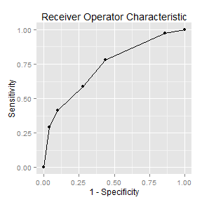

## Motivation

Decision trees for classification problems are very easy to represent and explain, but measuring and explaining their predictive power (especially if there are rare events, so accuracy isn't menaingful) isn't very easy.  This app lets users enter the output of a real tree or fiddle with the numbers to see the effect on the ROC curve and the AUC.

The ROC curve is a graph of the model's sensitivity vs specificity for the set of optimum decision rules (ie no way to increase number of true positives with fewer false negatives included as well).  AUC is simply the area under the ROC curve.

The example in these slides uses a non-reactive version of the Shiny code, applied to the default values in the application.  The application is available online at https://tristanmarkwell.shinyapps.io/AUCCalculator

--- 

## Inputs

There are 24 inputs: the number of positive cases, negative cases, and the risk score associated with each of the 8 leaves of the tree.  The cases are constrained to be non-negative integers, and the risk is constrained to be non-negative.  Anything left blank is forced to zero.  Using the default values:


```r
library(ggplot2)
treeDF <- data.frame(pos = c(0,3,12,8,5,7,5,1),
                     neg = c(0,6,2,8,3,9,15,7),
                     risk = c(.1,.2,.8,.3,.55,.5,.2,0))
treeDF[is.na(treeDF)] <- 0
```

--- .codefont

## ROC Curve

In order to properly accumulate the true positive and false positive rates, the values must be sorted by risk so that the highest-risk leaf is chosen first:


```r
risks <- unique(treeDF$risk)
ROCDF <- data.frame(pos=sapply(risks, function(g) sum(ifelse(g==(treeDF$risk),treeDF$pos,0))),
                    neg=sapply(risks, function(g) sum(ifelse(g==(treeDF$risk),treeDF$neg,0))),
                    risk=risks)
ROCDF <- ROCDF[order(ROCDF$risk, decreasing=TRUE),]
ROCDF <- rbind(data.frame(pos=0,neg=0,risk=NA),ROCDF)
ROCDF$TP <- cumsum(ROCDF$pos)/sum(ROCDF$pos)
ROCDF$FP <- cumsum(ROCDF$neg)/sum(ROCDF$neg)
ggplot(data=ROCDF, aes(x=FP, y=TP)) + geom_line() + geom_point() + ylab('Sensitivity') + xlab('1 - Specificity') + ggtitle('Receiver Operator Characteristic')
```

 


-------------

## AUC Calculation

Once the ROC is available the AUC becomes a matter of geometry.  Trapezoid area between two points on a line: $(x_{i+1}-x_{i}) \cdot \frac{y_{i+1}+y_{i}}{2}$


```r
trapHeight <- (ROCDF[2:nrow(ROCDF),'TP']+ROCDF[1:(nrow(ROCDF)-1),'TP'])/2
trapWidth <- ROCDF[2:nrow(ROCDF),'FP']-ROCDF[1:(nrow(ROCDF)-1),'FP']
paste0('AUC: ',round(sum(trapHeight*trapWidth),3))
```

```
## [1] "AUC: 0.733"
```


